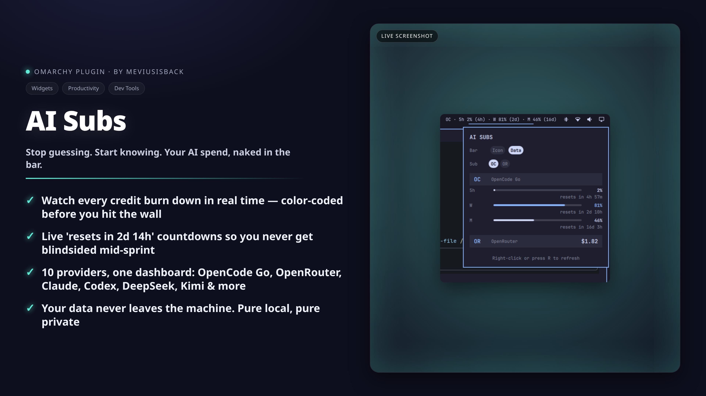

# AI Subs for Omarchy



AI subscription usage and balance directly in the Omarchy bar — meter bars,
credit balances and live reset countdowns, for every provider you have
configured (API keys in `~/.hermes/.env`, native config files, or OAuth tokens).

```text
OC · 5h 0% [──] (4h) · W 79% [━━──] (2d) · M 46% [━───] (16d)     (Data mode bar chip)
```

## Features

- **Meter bars per limit window** — OpenCode Go's rolling/weekly/monthly
  windows and prepaid credit bars, with color thresholds (accent past 70%,
  urgent red past 90%).
- **Live reset countdowns** — "resets in 2d 14h" under each window, ticking
  every second while the panel is open, and compact `(2d)` hints in the bar
  chip.
- **Two bar display modes** — a Sigma glyph or a compact one-liner for your
  default sub; switchable from the panel, persisted in `shell.json`.
- **Clean by default** — providers without keys never show up; no greyed-out
  placeholders.
- **Settings live in the panel** — Bar Icon/Data toggle and default-sub
  selector as segmented chips; no config files to hand-edit (but
  `omarchy bar set` works too).

## Supported providers

| Display | Provider | Metric | Key (`~/.hermes/.env`) |
|---------|----------|--------|------------------------|
| `OC` | OpenCode Go (+ Zen) | % used (5h / week / month) + resets | `OPENCODE_GO_API_KEY` |
| `OR` | OpenRouter | USD credits remaining | `OPENROUTER_API_KEY` |
| `CL` | Claude Code | % used per limit window + resets | none — reads Omarchy agent usage records |
| `CX` | Codex | % used per limit window + resets | none — reads Omarchy agent usage records |
| `CC` | Command Code | % used (5h / week / month) + USD balance remaining | `COMMANDCODE_API_KEY` |
| `DS` | DeepSeek | USD balance | `DEEPSEEK_API_KEY` (or `~/.deepseek/config.toml`) |
| `KI` | Kimi / Moonshot | USD balance | `KIMI_API_KEY` (or `~/.kimi-code/config.toml`) |
| `NV` | NovitaAI | USD balance | `NOVITA_API_KEY` |
| `Z` | ZAI / Zhipu | CNY balance | `ZAI_API_KEY` |
| `AB` | Alibaba / DashScope | USD balance | `DASHSCOPE_API_KEY` |
| `AR` | Arcee AI | USD balance | `ARCEE_API_KEY` |
| `CP` | GitHub Copilot | % used (chat / completions) | none — reads from gh CLI or editor OAuth token (opt-in) |
| `CU` | Cursor | USD plan spend | none — reads from Cursor local state DB (opt-in) |

Claude and Codex need no API keys: the widget reads the usage records that
Omarchy's own agent collectors write to
`~/.local/state/omarchy/agents/usage/`. Run those agents through Omarchy and
their limits appear automatically.

DeepSeek and Kimi fall back to their native config files (`~/.deepseek/config.toml`
and `~/.kimi-code/config.toml`) when the env var is not set.

Copilot and Cursor are **opt-in OAuth providers** (Tier 2): they read tokens
from the agent's own credential store and use them read-use-discard (never
cached). A one-time startup warning is logged when first activated.

> **Not supported:** Gemini (no public usage API — Google Cloud billing only)
> and OpenCode Zen credits (balance endpoint requested upstream in
> [anomalyco/opencode#10448](https://github.com/anomalyco/opencode/issues/10448);
> the shared Go key currently only exposes `/zen/go/v1/usage`).

## Install

```bash
omarchy plugin add https://github.com/meviusisback/omarchy-ai-subs.git --enable --yes
```

or interactively:

```bash
omarchy plugin add https://github.com/meviusisback/omarchy-ai-subs.git
```

Then add your API keys to `~/.hermes/.env`:

```sh
OPENCODE_GO_API_KEY=...
OPENROUTER_API_KEY=...
# etc.
```

Providers appear as soon as their key exists — no restart needed (the fetcher
refreshes every 15 minutes; right-click the widget or press `R` in the panel
to refresh immediately).

## Update & Remove

```bash
# Update a git-managed plugin
omarchy plugin update meviusisback.ai-subs --yes

# Remove the plugin entirely
omarchy plugin remove meviusisback.ai-subs --yes
```


## Settings

Click the bar icon to open the panel:

- **Bar** — `Icon` (Sigma glyph) or `Data` (compact one-liner for the default
  sub, e.g. `OC · 5h 0% (4h) · W 79% (2d) · M 46% (16d)`).
- **Sub** — which provider Data mode shows (only configured ones are listed).

Equivalent CLI:

```bash
omarchy bar set meviusisback.ai-subs barDisplay Data
omarchy bar set meviusisback.ai-subs defaultSub openrouter
omarchy bar set meviusisback.ai-subs refreshIntervalSec 300
```

## How it works

A stdlib-only Python script (`fetch_usage.py`) queries each vendor's
usage/balance endpoint in parallel and prints one JSON document; the QML panel
(`Panel.qml`) renders it as meter bars and countdowns inside the Omarchy shell.

**Credential sources** (checked in order):
1. Environment variables in `~/.hermes/.env`
2. Native config files (`~/.deepseek/config.toml`, `~/.kimi-code/config.toml`)
3. OAuth tokens from agent credential stores (Copilot, Cursor — read-use-discard, never cached)
4. Omarchy collector records (`~/.local/state/omarchy/agents/usage/`) for Claude and Codex

No data leaves your machine except the vendor API calls authenticated with your
own credentials.

## License

MIT — see [LICENSE](LICENSE).
